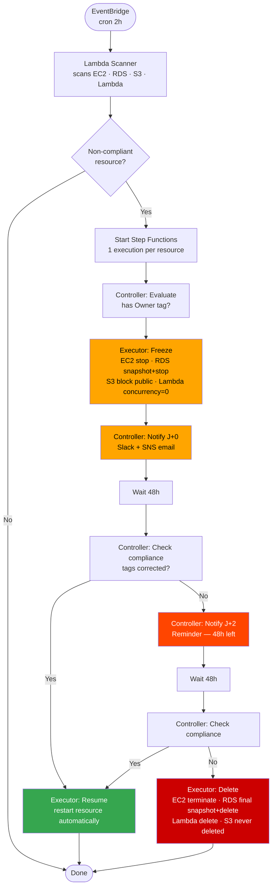

# AWS Tagging Governance

[](https://github.com/mboumhawahaga-ship-it/Aws-tagging-gouvernance/actions/workflows/ci-quality.yml)
[](https://github.com/mboumhawahaga-ship-it/Aws-tagging-gouvernance/actions/workflows/ci-infracost.yml)

> According to the **Flexera State of the Cloud Report 2024**, ~**32% of global cloud spend is wasted** on orphaned or untracked resources — largely because of missing tags.
> Organizations without enforced tagging typically have **~30% unallocated spend**. After implementing strict tagging + automation, this drops to **below 5%**.

This project implements **end-to-end automated tagging governance** on AWS: IaC enforcement, an intelligent escalation pipeline, FinOps metrics and cost visualization per team.

---

## Why not just use AWS Tag Policies + SCP?

| Capability | Tag Policies | SCP | This project |
|---|---|---|---|
| Enforce tag format | ✅ | ✅ | ✅ Terraform validation |
| Block creation without tags | ❌ | ✅ partial | ✅ Terraform |
| Handle **already existing** resources | ❌ | ❌ | ✅ Scanner Lambda |
| Escalation pipeline J0 → J2 → J4 | ❌ | ❌ | ✅ Step Functions |
| RDS snapshot before any action | ❌ | ❌ | ✅ Executor Lambda |
| Slack + SNS targeted notification | ❌ | ❌ | ✅ Controller Lambda |
| FinOps metrics + Grafana dashboard | ❌ | ❌ | ✅ Metrics Lambda |
| Works **without AWS Organizations** | ✅ | ❌ | ✅ |

Tag Policies + SCP = prevention at creation for large enterprises with Organizations.
**This project = complete governance** for any team, managing both new and existing resources.

---

## Architecture

```
┌──────────────────────────────────────────────────────────────────┐
│                        GitHub Actions CI                         │
│         flake8 · terraform fmt · terraform validate · infracost  │
└──────────────────────────────┬───────────────────────────────────┘
                               │
┌──────────────────────────────▼───────────────────────────────────┐
│                        Terraform (IaC)                           │
│  tagged-resources · governance-pipeline · metrics-lambda         │
└───────┬──────────────────────┬───────────────────────────────────┘
        │                      │
┌───────▼───────┐    ┌─────────▼──────────────────────────────────┐
│  AWS Resources│    │           Governance Pipeline               │
│  EC2 · RDS    │    │                                             │
│  S3  · Lambda │    │  EventBridge cron 2h                        │
│  tags enforced│    │       ↓                                     │
│  KMS · Secrets│    │  Lambda Scanner                             │
│  Manager      │    │  (detects non-compliant resources)          │
└───────────────┘    │       ↓  1 execution per resource           │
                     │  Step Functions State Machine               │
                     │  ├─ Controller (evaluate/notify/check)      │
                     │  └─ Executor   (freeze/resume/delete)       │
                     │       ↓                                     │
                     │  SNS email + Slack notification             │
                     └─────────────────────────────────────────────┘
                               │
┌──────────────────────────────▼───────────────────────────────────┐
│                    Lambda Metrics (every 6h)                     │
│              CloudWatch · Cost Explorer API                      │
└──────────────────────────────┬───────────────────────────────────┘
                               │
┌──────────────────────────────▼───────────────────────────────────┐
│                         Grafana Dashboard                        │
│          compliance rate · costs/squad · AutoShutdown savings    │
└──────────────────────────────────────────────────────────────────┘
```

---

## Governance pipeline — the thinking behind it

> **Why not just delete automatically?**
> A dev creates an RDS on a Friday night for an incident — no time for tags.
> An auto-delete at 2 AM = data loss. That's a production incident.
> The right pattern: **alert → freeze → give time → delete as last resort.**



---

## Mandatory tags

All AWS resources **must** have these tags — Terraform rejects creation if one is missing.

| Tag | Validation | Example | FinOps impact |
|-----|------------|---------|---------------|
| `Owner` | email regex `@company.com` | `john.doe@company.com` | Clear accountability |
| `Squad` | non-empty | `Data`, `Backend`, `DevOps` | Team-level chargeback |
| `CostCenter` | non-empty | `CC-123` | Financial showback |
| `AutoShutdown` | boolean | `true` / `false` | ~50% savings on dev envs |
| `Environment` | `dev`/`staging`/`prod` | `prod` | Cost separation per env |

**Automatic tags**: `ManagedBy: Terraform` · `CreatedAt: <stable timestamp via time_static>`

---

## What happens per resource type

| Resource | Freeze (J+0) | Resume (if fixed) | Delete (J+4) |
|---|---|---|---|
| EC2 | `stop_instances` | `start_instances` | `terminate_instances` |
| RDS | snapshot + `stop_db_instance` | `start_db_instance` | final snapshot + `delete_db_instance` |
| S3 | block public access + enable versioning | — | **never deleted automatically** |
| Lambda | `concurrency = 0` | `delete_concurrency` | `delete_function` |

---

## FinOps features

**1. Enforcement at creation (Terraform)**
- Regex validation on `Owner` — rejects deployment if any tag is missing
- Encryption by default: RDS (KMS) + S3 (AES-256)
- RDS password auto-generated (32 chars) → stored in Secrets Manager

**2. Governance pipeline (Step Functions + 3 Lambdas)**
- `scanner` — detects non-compliant resources, launches 1 Step Function per resource
- `controller` — evaluates, checks compliance, sends Slack + SNS notifications
- `executor` — freeze / resume / delete with `DRY_RUN=true` by default
- Retry (3x backoff) + Catch on every state → `NotifyFailure` if pipeline errors
- Lambda Powertools on all 3: structured logs, X-Ray tracing, CloudWatch metrics

**3. Real-time FinOps metrics (Lambda + CloudWatch)**
- Global tag compliance rate (namespace `TagCompliance`)
- Spend per `Squad` and `CostCenter` via Cost Explorer API
- Estimated savings from `AutoShutdown` tag
- Top 10 most expensive AWS services
- Runs every 6 hours via EventBridge

**4. Grafana dashboard**
- Total monthly cost for current month
- Tag compliance gauge (target: > 95%)
- Cost breakdown by Squad (donut chart)
- 30-day cost evolution (time series)
- Non-compliant resources highlighted in red if > 5

---

## Project structure

```
aws-tagging-governance/
├── .github/workflows/
│   ├── ci-quality.yml              # Flake8 + terraform fmt/validate
│   └── ci-infracost.yml            # Cost estimation on PRs
├── terraform/
│   ├── modules/
│   │   ├── tagged-resources/       # Tag enforcement — EC2, RDS, S3, Lambda
│   │   ├── governance-pipeline/    # Scanner + Controller + Executor + Step Functions
│   │   ├── metrics-lambda/         # CloudWatch metrics + Cost Explorer
│   │   └── cleanup-lambda/         # Legacy cleanup (kept for reference)
│   └── environments/
│       ├── dev/                    # Dev environment
│       └── prod/                   # Production environment (dry_run=true)
├── lambda/
│   ├── scanner/                    # Detects non-compliant resources
│   ├── controller/                 # Evaluate · notify · check compliance
│   ├── executor/                   # Freeze · resume · delete
│   ├── metrics/                    # FinOps metrics collection
│   └── cleanup/                    # Legacy + unit tests (moto)
├── grafana/
│   ├── dashboards/                 # Dashboard JSON (CloudWatch datasource)
│   └── provisioning/               # Auto-configured datasource
├── scripts/
│   ├── publish_mock_metrics.py     # Feeds dashboard for demos
│   ├── validate-tags.sh            # Manual tag validation
│   └── setup-cost-explorer.ps1     # Cost Allocation Tags activation
└── docs/
    ├── GUIDE_DEMARRAGE.md          # Getting started guide
    ├── SECURITY.md                 # Security best practices
    └── JOURNAL_DE_BORD.md          # Engineering log — errors & solutions
```

---

## Quick start

```bash
# 1. Clone
git clone https://github.com/mboumhawahaga-ship-it/Aws-tagging-gouvernance.git

# 2. Configure AWS credentials
cp sensible/.env.example sensible/.env
# Edit sensible/.env with your AWS credentials

# 3. Deploy infrastructure
cd terraform/environments/dev
terraform init
terraform plan
terraform apply

# 4. Launch Grafana dashboard (local demo)
cd ../../..
docker-compose up -d
python scripts/publish_mock_metrics.py
# → http://localhost:3000
```

---

## Tests

```bash
# Lambda unit tests (moto — AWS simulation, zero cost)
cd lambda/cleanup
pip install pytest moto boto3
pytest test_handler.py -v

# Terraform validation
cd terraform/environments/dev
terraform validate

# Manual tag validation on existing resources
bash scripts/validate-tags.sh
```

---

## Notable technical choices

| Decision | Rationale |
|----------|-----------|
| Step Functions for escalation | Native wait states, retry/catch, full execution history in console |
| `DRY_RUN=true` by default | Zero risk during first rollout — observe before acting |
| 48h grace periods (x2) | Realistic time for a dev to fix tags before deletion |
| S3 never auto-deleted | A bucket can hold data from multiple teams — human decision required |
| RDS always snapshot before delete | Data safety — final snapshot kept even after deletion |
| Lambda Powertools | Structured logs + X-Ray tracing + CloudWatch metrics on all 3 Lambdas |
| Slack webhook via Secrets Manager | Webhook URL never exposed in env vars or Terraform state |
| `arm64` for all Lambdas | ~20% cheaper than x86 on AWS Graviton |
| `time_static` for `CreatedAt` | Stable tag — no noisy Terraform diffs on every plan |
| Secrets Manager for RDS | Zero secrets in Terraform state or environment variables |

---

## Results on demo environment

| Metric | Value |
|--------|-------|
| Resources scanned | 24 |
| Initial compliance rate (before project) | ~30% (industry estimate) |
| Target compliance rate | > 95% |
| Total monthly cost (dev env) | ~$971 |
| Estimated savings via AutoShutdown | **~$48/month** |
| Unallocated costs after tagging | < 5% |

> **Source**: Flexera State of the Cloud 2024 — [flexera.com](https://info.flexera.com/CM-RESEARCH-State-of-the-Cloud-Report)

---

## License

MIT License
